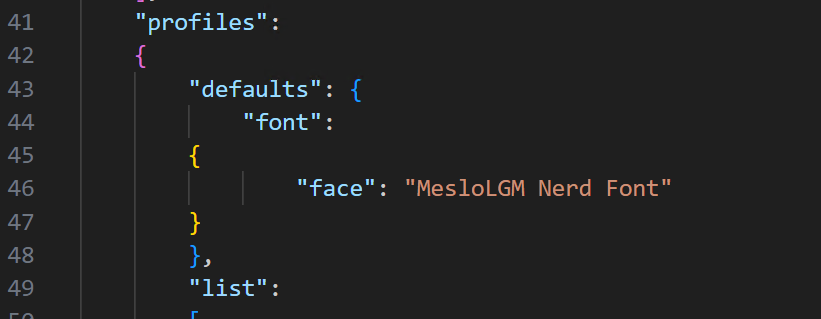
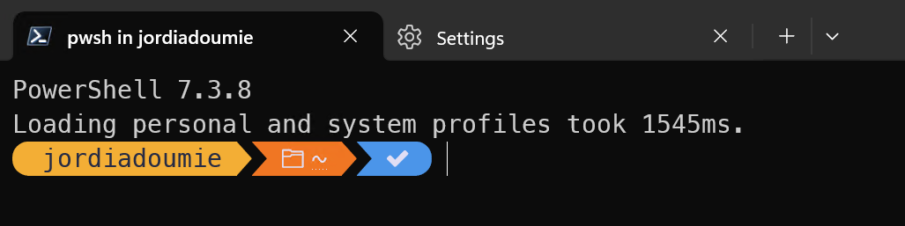
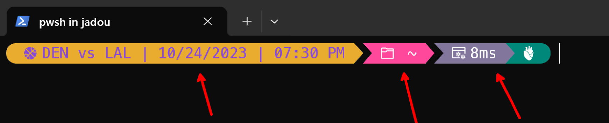
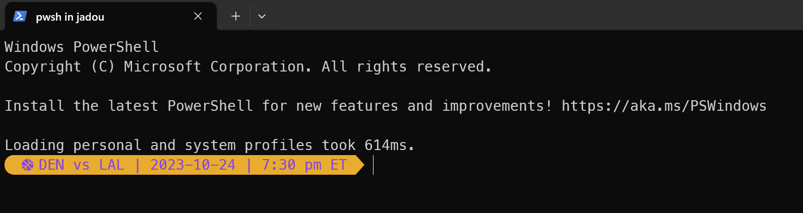

## Introduction

I just built a thing. I'm a huge basketball fan, and as a developer, I'm also always in Windows Terminal. So, why shouldn't I be able to see information about my favorite basketball team on a surface I spend A LOT of my time staring at?

The result looks pretty good... but doesn't change the fact the Lakers can still lose apparently:


If you're interested in learning how to program/build your own segment for your favorite shells, check out the [video](https://youtu.be/NR7i0SKFbtI) I made where I built ^ this exact NBA segment from scratch!

## Set Up Oh My Posh

I'll walkthrough how this all works on my Windows machine, using Windows Terminal with PowerShell, but remember that you can get the same effects on ANY OS with practically ANY shell. I'll include links to getting set up on other machines/shells.

# What is Oh My Posh

[Oh My Posh](https://ohmyposh.dev/) is an awesome open-source prompt theme engine for any shell. This means that if you're running Linux, Mac, Windows, whatever shell you have... it is compatible and will run on your machine.

# Install Oh My Posh

[Install Oh My Posh on Mac](https://ohmyposh.dev/docs/installation/macos)

[Install Oh My Posh on Linux](https://ohmyposh.dev/docs/installation/linux)

[Install Oh My Posh on Windows](https://ohmyposh.dev/docs/installation/windows)

To get setup, you first need to install Oh My Posh. On Windows, you can install Oh My Posh in the Microsoft store, or you can use winget:


# Getting Oh My Posh Set up in PowerShell

I'll walk through how to get this running in PowerShell, but you can follow the [Oh My Posh guide](https://ohmyposh.dev/docs/installation/prompt) to get this setup on ANY shell.

In order to get oh my posh working in powershell, we'll have to add some stuff to the $PROFILE. Type the following command in the command-line:

`notepad $PROFILE`

You can use any application to edit this file. If you get an error in this step that the $PROFILE file does not yet exist, it means you first need to create it. You can do the following to create it:

`New-Item -Path $PROFILE -Type File -Force`

Now you'll need to add some information into $PROFILE to get oh my posh to render stuff inside of PowerShell. Copy and paste the following command:

`oh-my-posh init pwsh | Invoke-Expression`

Once you've saved the file changes, you'll need to reload your profile for the changes to take effect. You can use the following command:

`. $PROFILE`

For me personally, I had to **restart Windows Terminal** and that seemed to work well... but wait! Look at this...


That doesn't look good at all! Well it turns out that the default profile and theming uses something called ["Nerd Fonts"](#installing-nerd-fonts), so a lot of stuff doesn't really seem to render properly without it. You can create your own theming to not use nerd fonts, but I highly recommend them because I think they make the whole thing look a whole lot better!

# Installing Nerd Fonts

The [oh my posh documentation](https://ohmyposh.dev/docs/installation/fonts) does a great job at showing how to install nerd fonts, but I figured let's outline how to do so in here as well. You can install a variety of nerd fonts, but I personally have been really liking Meslo LGM Nerd Font. You can install the font [here](https://github.com/ryanoasis/nerd-fonts/releases/download/v3.0.2/Meslo.zip). You'll need to extract the files from the zip folder. Then, select all of the TrueType font files within the folder, right-click and select "Install": 


Check out the oh my posh documentation for installing nerd fonts for other operatings systems, as I'm less familiar with that process, but I assume it's probably just as easy!

Great! Now we should have the proper fonts installed on the machine to actually render the segments, but now we actually have to get the fonts to render inside of Windows Terminal. 

# Getting Nerd Fonts to Render in Windows Terminal

In Windows Terminal, you can open up the settings by clicking on the dropdown arrow next to the plus sign, and selecting "Settings". Then, click on 'Open JSON file' to open up the settings file in your default JSON editor:


Add the following block into the defaults of the settings file:



And voila! Look at the end result!



That's so much better! Now we can actually see the segments and the icons that are being rendered. Finally, we need to [add the NBA segment to the prompt](#including-the-nba-segment-in-your-own-oh-my-posh-profile).

## Including the NBA Segment in Your Own oh my posh Profile

Finally, we can start discussing adding the NBA segment to your oh-my-posh prompt.

### Segments & Themes

First off, a segment is a piece of information that is rendered in the prompt. Segments can be anything from the current time, to the current git branch, to the current NBA score. You can find a list of all the segments [here](https://ohmyposh.dev/docs/segments).

For example, you can see a few segments pointed out in the image below:



In general, themes are a specific collection of segments that the community has put together. Themes are the way that you can customize the look and feel of your prompt. You can create your own themes, or you can use one of the many themes that are already available. You can find a list of themes [here](https://ohmyposh.dev/docs/themes).

### NBA Segment Anatomy and Setting Up a Custom Theme

The standard initialization sets Oh My Posh's default theme. This configuration is embedded and thus kept up-to-date with Oh My Posh.

To set a new config/theme you need to change the --config option of the oh-my-posh init that we previously added to the $PROFILE.

For example: 

```powershell
oh-my-posh init pwsh --config 'C:/Users/Posh/jandedobbeleer.omp.json' | Invoke-Expression
```

Themes themsleves are simply .json files. You can find a bunch of examples on the GitHub repo [here](https://github.com/JanDeDobbeleer/oh-my-posh/tree/main/themes).

Let's create a new theme, that JUST contains the NBA segment and then light it up in PowerShell. While I like to include a bunch of segments personally, I'll start with just the NBA segment and that way you can explore more segments on your own.

```json
{
  "$schema": "https://raw.githubusercontent.com/JanDeDobbeleer/oh-my-posh/main/themes/schema.json",
  "blocks": [
    {
      "alignment": "left",
      "segments": [
        {
          "background": "#e9ac2f",
          "foreground": "#8748dc",
          "leading_diamond": "\ue0b6",
          "style": "diamond",
          "trailing_diamond": "\ue0b0",
          "type": "nba",
          "properties": {
            "team":"LAL",
            "http_timeout": 1500,
	        "season": "2023",
	        "days_offset": 8
          }
        }
      ],
      "type": "prompt"
    }
  ],
  "console_title_template": "{{ .Shell }} in {{ .Folder }}",
  "final_space": true,
  "version": 2
}
```

This is a pretty simple theme, and should look something like this:



In order to use the NBA segment, you need to provide a valid team
[tri-code](https://liaison.reuters.com/tools/sports-team-codes) that you'd
like to get data for inside of the configuration. For example, if you'd like
to get information for the Los Angeles Lakers, you'd need to use the "LAL"
tri-code.  

This example uses "LAL" to get information for the Los Angeles Lakers. It also
sets the foreground and background colors to match the theming for the team.
If you are interested in getting information about specific foreground and
background colors you could use for other teams, you can explore some of
the color schemes [here](https://teamcolorcodes.com/nba-team-color-codes/).

In the snippet above, you can see that the NBA segment has a few properties that you can set:

| Name        | Type     | Description                                                                                                |
| ----------- | -------- | ---------------------------------------------------------------------------------------------------------- |
| "team"    | `string` | The team that you'd like to get information for. This is a required field. |
| "http_timeout"     | `string` | The amount of time you are willing to wait for the API to respond before timing out. This is an optional field. I recommend keeping this to AT LEAST 1500 ms|
| "season"        | `string` | The season you'd like to get information for. This is an optional field. If you don't provide a season, it will default to the current season. If you provide a previous season tbh... idk what will happen. Likely will just NOT work. | 
| "days_offset"      | `string` | The number of days into the future you'd like to search for the upcoming game. This is an optional field. If you don't provide a days offset, it will default to 8 days. |
