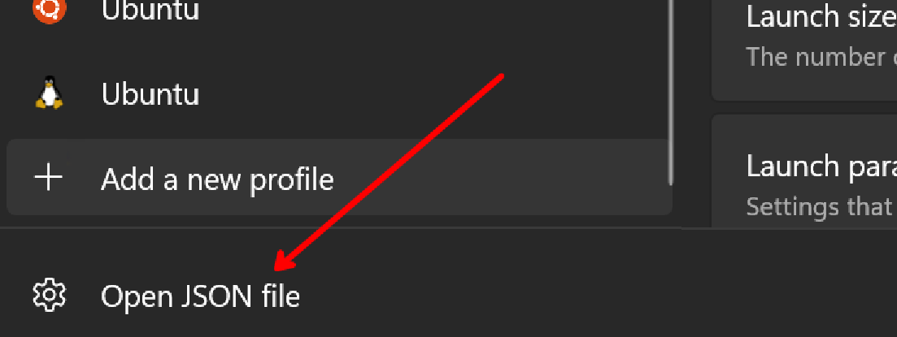

## Introduction

I just built a thing. I'm a huge basketball fan, and as a developer, I'm also always in Windows Terminal. So, why shouldn't I be able to see information about my favorite basketball team on a surface I spend A LOT of my time staring at?

The result looks pretty good... but doesn't change the fact the Lakers can still lose apparently:

If you're interested in learning how to build your own segment for your favorite shells, check out the [video](https://youtu.be/NR7i0SKFbtI) I made where I built ^ this exact NBA segment from scratch!

## Set Up Oh My Posh

I'll walkthrough how this all works on my Windows machine, using Windows Terminal with PowerShell, but remember that you can get the same effects on ANY OS with practically ANY shell. I'll include links to getting set up on other machines/shells.

# What is Oh My Posh

[Oh My Posh](https://ohmyposh.dev/) is an awesome open-source prompt theme engine for any shell. This means that if you're running Linux, Mac, Windows, whatever shell you have... it is compatible and will run on your machine.

# Install Oh My Posh

[Install Oh My Posh on Mac](https://ohmyposh.dev/docs/installation/macos)

[Install Oh My Posh on Linux](https://ohmyposh.dev/docs/installation/linux)

[Install Oh My Posh on Windows](https://ohmyposh.dev/docs/installation/windows)

To get setup, you first need to install Oh My Posh. On Windows, you can install Oh My Posh in the Microsoft store, or you can use winget:

# Getting Oh My Posh Set up in PowerShell

I'll walk through how to get this running in PowerShell, but you can follow the [Oh My Posh guide](https://ohmyposh.dev/docs/installation/prompt) to get this setup on ANY shell.

In order to get oh my posh working in powershell, we'll have to add some stuff to the $PROFILE. Type the following command in the command-line:

`notepad $PROFILE`

You can use any application to edit this file. If you get an error in this step that the $PROFILE file does not yet exist, it means you first need to create it. You can do the following to create it:

`New-Item -Path $PROFILE -Type File -Force`

Now you'll need to add some information into $PROFILE to get oh my posh to render stuff inside of PowerShell. Copy and paste the following command:

`oh-my-posh init pwsh | Invoke-Expression`

Once you've saved the file changes, you'll need to reload your profile for the changes to take effect. You can use the following command:

`. $PROFILE`

For me personally, I had to **restart Windows Terminal** and that seemed to work well... but wait! Look at this...

That doesn't look good at all! Well it turns out that the default profile and theming uses something called ["Nerd Fonts"](#installing-nerd-fonts), so a lot of stuff doesn't really seem to render properly without it. You can create your own theming to not use nerd fonts, but I highly recommend them because I think they make the whole thing look a whole lot better!

# Installing Nerd Fonts

The [oh my posh documentation](https://ohmyposh.dev/docs/installation/fonts) does a great job at showing how to install nerd fonts, but I figured let's outline how to do so in here as well. You can install a variety of nerd fonts, but I personally have been really liking Meslo LGM Nerd Font. You can install the font [here](https://github.com/ryanoasis/nerd-fonts/releases/download/v3.0.2/Meslo.zip). You'll need to extract the files from the zip folder. Then, select all of the TrueType font files within the folder, right-click and select "Install": 

Check out the oh my posh documentation for installing nerd fonts for other operatings systems, as I'm less familiar with that process, but I assume it's probably just as easy!

Great! Now we should have the proper fonts installed on the machine to actually render the segments, but now we actually have to get the fonts to render inside of Windows Terminal. 

# Getting Nerd Fonts to Render in Windows Terminal

In Windows Terminal, you can 

## Including the NBA Segment in Your Own oh my posh Profile
